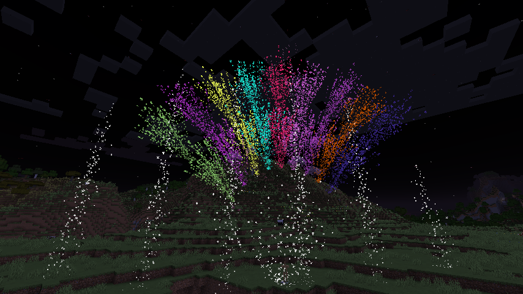

# FireworkStation

[日本語で読む](README_ja.md)

Fireworks Auto Play Datapack


## Tested Versions

- 1.21

For the following versions, please check Releases on the right.

- 1.18.2
- 1.19

## Types of Fireworks

### Summer 2022

1. **Order**  
   Launches in sequence from left to right.
2. **Cross**  
   Launches crossing each other simultaneously.
3. **Circle**  
   Launches forming a large circle.
4. **Garden**  
   Blooms like a garden.
5. **Aurora**  
   Spreads across the sky.
6. **Flower**  
   Blooms in a fan shape.
7. **Witch**  
   Blooms like a broom from left to right.
8. **Comet (Low Chance)**  
   Appears as if approaching the viewers.

### Summer 2024

Occasionally, fireworks will appear as items (excluding Flower/Witch/Comet).  
This can be disabled via a command.

## How to Use

### Basics

Just place an armor stand named "FireworkStation"!  
Multiple stands will launch fireworks from each one.  
Breaking all stands will stop the fireworks.  

### Command Operations

```nim
Enable item fireworks
/function #firework_station:item_mode/on
  
Disable item fireworks
/function #firework_station:item_mode/off
```

```nim
Place the firework station
/function #firework_station:station/place
  
Make the firework station invisible
/function #firework_station:station/hide
  
Make the firework station visible
/function #firework_station:station/show
```

```nim
Start launching fireworks
/function #firework_station:auto/on
  
Stop launching fireworks
/function #firework_station:auto/off
```

```nim
Night Mode
Changes the following game rules:
1. Switches to night
2. Disables daylight cycle
3. Disables enemy spawning
  
Enable
/function #firework_station:night_mode/on
Disable
/function #firework_station:night_mode/off
```

```nim
Restrict operations to commands only
Restrict
/function #firework_station:command_only/true
Do not restrict
/function #firework_station:command_only/false
```

## Contact

<https://twitter.com/AiAkaishi>

## License

These codes are released under the MIT License, see LICENSE.
