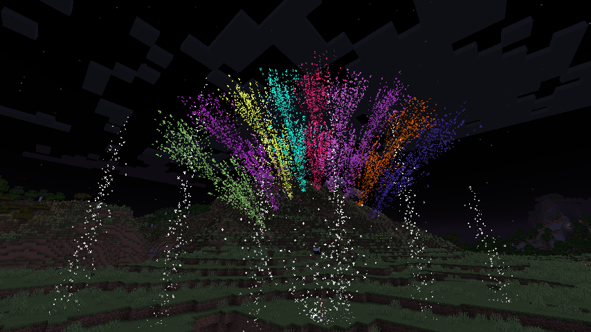

# FireworkStation

[Read in English](README.md)

花火大会データパック


## 動作確認済みバージョン

- 1.21

以下のバージョンは右のReleasesからどうぞ。  

- 1.18.2
- 1.19

## 花火の種類

### Summer 2022

1. **オーダー**  
  左から右へ順番に打ち上がります
2. **クロス**  
  同時に交差しながら打ち上がります
3. **サークル**  
  大きな円を描くように打ち上がります
4. **ガーデン**  
  庭のように咲き広がります
5. **オーロラ**  
  一面に並んで咲き広がります
6. **フラワー**  
  扇状に咲き広がります
7. **ウィッチ**  
  左から順番にホウキのように咲きます
8. **コメット(低確率)**  
  見ている人に近づくように咲きます

### Summer 2024

時々、花火の見た目がアイテムになります。(フラワー/ウィッチ/コメットを除く)  
コマンドで無効化できます。

## 使い方

### 基本

防具立てに FireworkStation と名付けて設置するだけ！  
複数設置するとそれぞれから打ちあがります。  
全て壊すと止まります。  

### コマンドによる操作

```mcfunction
アイテム花火有効化
/function #firework_station:item_mode/on
  
アイテム花火無効化
/function #firework_station:item_mode/off
```

```mcfunction
設置
/function #firework_station:station/place
  
透明化
/function #firework_station:station/hide
  
透明化解除
/function #firework_station:station/show
```

```mcfunction
花火打ち上げ開始
/function #firework_station:auto/on
  
花火打ち上げ停止
/function #firework_station:auto/off
```

```mcfunction
夜モード
以下のゲームルールに変更します。
1. 夜に変更
2. 日照サイクル無効
3. 敵スポーン無効
  
有効化
/function #firework_station:night_mode/on
無効化
/function #firework_station:night_mode/off
```

```mcfunction
コマンド以外での操作の制限
制限する
/function #firework_station:command_only/true
制限しない
/function #firework_station:command_only/false
```

## 連絡はこちら

<https://twitter.com/AiAkaishi>

## ライセンス

これらのコードはMITライセンスの下で公開されています。LICENSEファイルを参照してください。
